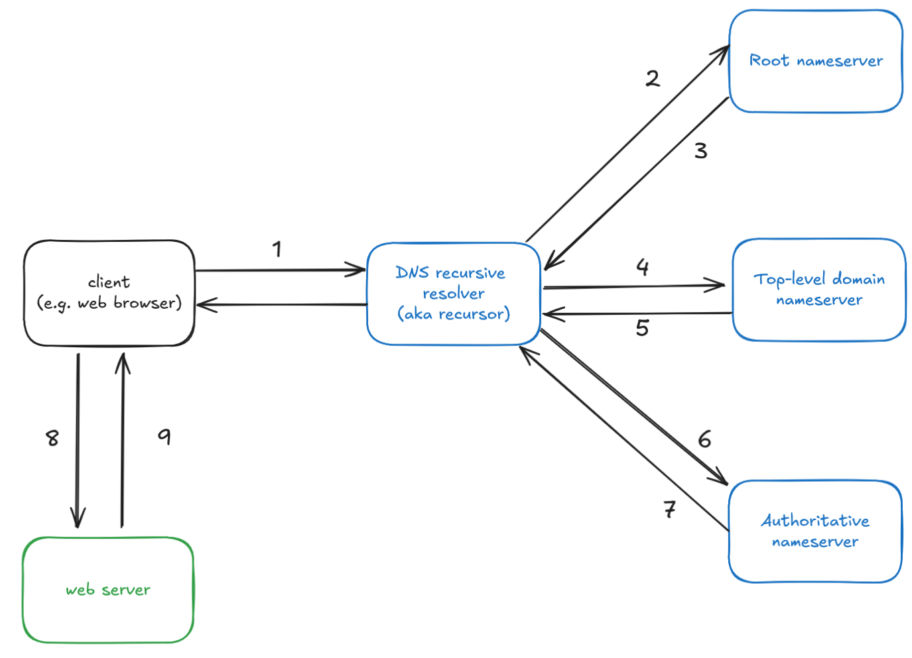

+++
title = 'Computer Networking - Part 2: DNS'
summary = 'What happens when you enter a website into your web browser?'
tags = ["networking", "introduction", "dns"]
date = 2024-09-13
showToc = true
draft = false
+++

## Introduction

In this series, I explain the fundamental concepts that underpin computer networking.

In [part 1](/posts/2024/07-sep/2024-09-07_networking_1), we learned about IP addresses. In part 2, we'll talk about the domain name system. Specifically, what happens behind the scenes when you enter a domain like `en.wikipedia.org` in your web browser?

## Domain Names

**Domain names** are human-friendly text strings that you can type in a web browser to visit your favourite website. For example, the domain name for this blog is `partitionskew.github.io`. It's much more convenient to use a domain name than it is to memorize an IPv4 or IPv6 address. Domain names need not be limited to websites and web browsers. Basically any application on the internet could have a domain name associated with it.

While it may sound obvious, you can't just claim any domain name as your own. Domain registries contain a list of all reserved or active domain names. You'll need to periodically renew your domains with a domain registrar.

In truth, domains are really just aliases for the actual IP address of the web server that hosts the web content. Remember, every device on the internet is reachable via its IP address and websites or web apps are no different.

### Domain Names vs. URLs

There's often confusion between domain names and URLs. URLs are not needed to understand the domain name system (DNS), but let's disambiguate the two terms regardless.

**Uniform Resource Locators** (URLs), aka web addresses, are also addresses just like an IP address. Whereas an IP address refers to a single device or machine on a network, a URL refers to a unique resource on the network. Examples of resources include a picture, a video, your bank account, or basically anything else you might want to interact with. 

Here's an example of a URL: `https://partitionskew.github.io/posts/2024/07-sep/2024-09-14_networking_2/`

As we can see, a URL is composed of a domain name but it also has other parts as well. The prefix `https` is the **scheme** of the URL. The scheme indicates the protocol used by the web browser to communicate with the backend server you're trying to reach. HTTPS stands for secure hyper-text transfer protocol. It is, without doubt, the most important and common protocol used on the internet. We'll talk about HTTP(S) in another post.

The rest of the URL, `/posts/2024/07-sep/2024-09-14_networking_2/` is the path to the specific resource that you want to retrieve from the web server.

There's other parts of the URL such as the port, query parameters, or the anchor. If you're curious about each of these parts, refer to Mozilla's excellent [docs](https://developer.mozilla.org/en-US/docs/Learn/Common_questions/Web_mechanics/What_is_a_URL).

## Domain Name System

**Domain Name System** (DNS) is a distributed system that allows you to retrieve the corresponding IP address for a given domain name. A distributed system is simply an application that runs on more than one machine and each part communicates with each other over the network. Contrast this with a simple system that runs on one machine such as a single-player video game or an offline calendar app. 

When you type https://partitionskew.github.io in your favourite web browser, the first thing your web browser does is issue a DNS query to find out what the IP address of the web server is. When DNS returns the IP address, your operating system and website memorizes the mapping so that it doesn't have to re-issue the DNS query again the next time you visit this blog. Armed with the IP address, your browser can communicate directly with the web server which then returns this blog post to your browser to be rendered locally.

It's also possible for DNS to fail to return an answer. Maybe you entered a domain name that doesn't exist or hasn't been registered yet. Or maybe it existed at one point but the owner forgot to renew the domain name and it expired. Or maybe your DNS query got lost somewhere along the way and you'll need to resubmit the query. Or maybe your computer isn't even connected to the internet.

There are 4 important servers that make up the DNS system.

1. DNS recursive resolver
2. Root nameserver
3. Top level domain (TLD) nameserver
4. Authoritative nameserver

Let's talk about each of these types of servers in greater detail.

### DNS recursive resolver

First, the **DNS recursive resolver** is the first DNS server that a client contacts during a DNS query. The client may be your web browser, a desktop or mobile application, or even a command line tool such as `curl`. The responsibility of the DNS recursor is to make as many DNS requests as needed to find the answer or return a failure to the client. The recursor will first check if it already has the answer stored in memory. This is called **caching** and it helps the recursor avoid making the same DNS requests over and over again for popular domains. After all, DNS is a shared, public system so you are most certainly not the only person issuing DNS queries. 

There are several DNS recursive resolvers to choose from. Your ISP typically provides a resolver. Other common resolvers include Google's DNS resolver (IP: 8.8.8.8 or 8.8.4.4) or Cloudflare's resolver (IP: 1.1.1.1).

If it doesn't have the answer cached, it will forward the request to the next DNS server which is the root nameserver.

### Root nameserver

The recursor forwards the same domain it received from the client to the **root nameserver**. The root nameserver checks the top level domain and then tells the recursor which top-level domain (TLD) nameserver to contact next. The TLD is the suffix in a domain name. For example, the TLD in `github.com` is `.com`. In this example, the root nameserver would tell the DNS recursor to contact the `.com` TLD nameserver next. The same applies for other extensions like `.net`, `.org`, and so on.

Just like how your computer already knows the IP address of a DNS recursor (either your ISP set it up on your behalf or you picked one yourself), all of the DNS recursors know the IP addresses of the root nameservers. 

There's no way a single root nameserver could handle all of the world's DNS queries. Hence there's 13 total root nameserver domains starting with `a.root-servers.net` and ending in `m.root-servers.net`. Each of these have corresponding IPv4 and IPv6 addresses that are, again, permanently cached in each of the DNS recursors. There isn't just 13 machines however. Each domain is backed by multiple machines and a DNS request that goes to `a.root-servers.net` could be forwarded to any of the machines responsible for processing the queries that landed at that domain. This is known as **load balancing** which is a technique for spreading traffic across multiple machines.

When the DNS recursor submits a DNS query, it typically gets forwarded to the closest root nameserver whether that is geographically or in terms of the time that it takes to reach the nameserver (i.e. latency).

### Top-level domain (TLD) nameserver

A TLD nameserver is responsible for managing the domains that end in a common domain extension such as `.com`, `.net`, `.gov`, and so on. When the DNS recursor sends a DNS query to the TLD nameserver, it will return the IP address of the authoritative nameserver back. The authoritative nameserver contains the actual answer that the DNS recursor (and therefore the client) is looking for.

### Authoritative nameserver

The authoritative nameserver contains the DNS records that can either directly or indirectly answer the question - what is the IP address of this domain name?

If the domain name matches a DNS A record, then the A record will contain the IP address for the domain name. This IP address is returned to the recursor which then returns it to the client as the answer. The recursor will cache the domain:IP mapping for some amount of time so that it doesn't have to perform the same query again for a while.

If the domain name matches a DNS CNAME record, then the record actually maps the domain name to another domain name. The DNS recursor will have to issue another DNS query for the new domain name to get the corresponding IP address which it can then return to the client. 

Either way, the client hopefully gets an IP address so that it can then contact the server at that IP address to begin communication and retrieve the information it's looking for.

## DNS records

DNS records are text files that are stored in authoritative nameservers. There are different types of DNS records that serve different purposes. All DNS records typically have an expiration date which is indicated by the time-to-live (TTL). Usually the record's TTL gets refreshed and nothing changes. Other times, the DNS record gets updated or removed and the TTL ensures that cached copies of it in the DNS recursor or the clients also expire so that the client can refetch the latest copy.

### DNS A record

An A record maps a domain name to an IPv4 address.

| Domain | Record Type | Value | TTL (seconds) |
| --- | --- | --- | --- |
| example.com | A | 1.2.3.4 | 86400 (1 day) |

### DNS AAAA record

It's basically the same as an A record except it maps a domain name to an IPv6 address.

| Domain | Record Type | Value | TTL (seconds) |
| --- | --- | --- | --- |
| another-example.org | A | 1:f:b:3:4:6:8:d | 3600 (1 hour) |

### DNS CNAME record

A CNAME record maps a domain name to another domain name. 

You might be confused as to why we even need to do this. There's a couple valid reasons. One reason is that it allows you to point different domain names to the same IP address. This doesn't mean these different domains have to refer to the same web application or even the same resource. The server located at the same IP address can still look at the URL and return different content. For example, you can perform DNS queries for `blog.example.com` and `shop.example.com` and they may both resolve to the same IP address, but the server will return the blogs section of the website for the former domain whereas the latter might be the shop where you can order stuff. Remember, IPv4 addresses are very limited so it's generally a good idea to re-use IP addresses as much as possible.

Another reason is purely bureaucratic or organizational. Consider an IT team that's responsible for provisioning servers and assigning them IP addresses and domain names. The IT team may have a convention for how it names the domain name of the server which is not exactly easy to remember. Hence, you as the application or web developer may choose a friendlier, easier-to-remember domain name and then create a CNAME record so that it becomes an alias for the actual domain name of the server.

| Domain | Record Type | IP Address | TTL (seconds) |
| --- | --- | --- | --- |
| some-subdomain.domain.org | CNAME | domain.org | 3600 (1 hour) |

| Domain | Record Type | IP Address | TTL (seconds) |
| --- | --- | --- | --- |
| domain.org | A | 3.3.3.3 | 3600 (1 hour) |

## Summary

Putting it all together, this is what happens when you enter a URL in your web browser:

1. The client (e.g. web browser) checks its cache for an cache entry that contains the mapping of the domain name to an IP address. If the cached entry exists, then the IP address is used to contact the web server. No DNS query is issued.
2. If the IP address was not cached, then the client issues a DNS query to a DNS recursive resolver. The DNS recursive resolver contacts the nearest root nameserver.
3. The root nameserver returns the appropriate TLD nameserver to the DNS recursive resolver
4. The DNS recursive resolver contacts the TLD nameserver.
5. The TLD nameserver returns the authoritative nameserver that is responsible for the domain.
6. The recursor next contacts the authoritative nameserver. The recursive nameserver either returns the IP address if it contains the corresponding DNS A or AAAA record. Otherwise, if it's a CNAME record, then the authoritative nameserver returns a domain name. The DNS recursive resolver will have to issue another DNS query to map this new domain name to an IP address.
7. Finally, when the recursor obtains an IP address, it will store it in cache and then return it as an answer to the client.
8. When the client gets the IP address, it can then communicate directly with the web server to fetch the appropriate content (e.g. photos, video content, HTML, etc...)

## References

### Cloudflare

* [What is a domain name?](https://www.cloudflare.com/en-ca/learning/dns/glossary/what-is-a-domain-name/)
* [What is DNS?](https://www.cloudflare.com/en-ca/learning/dns/what-is-dns/)
* [DNS server types](https://www.cloudflare.com/en-ca/learning/dns/dns-server-types/)
* [What is a DNS CNAME record?](https://www.cloudflare.com/en-ca/learning/dns/dns-records/dns-cname-record/)
